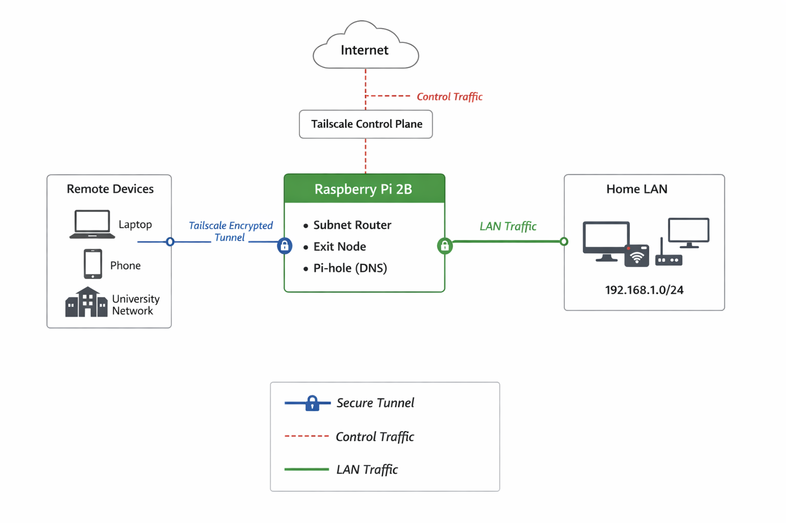

# Raspberry Pi Homelab – Containerized Network & Services Stack

## Overview

This repository documents my personal homelab architecture built around a Raspberry Pi 2B acting as a permanent infrastructure node.

The system provides:

- Secure remote access to my home LAN
- Containerized self-hosted services
- Centralized DNS filtering
- Lightweight NAS functionality
- Infrastructure observability and monitoring
- Overlay networking without exposing public ports

The goal was to design a secure, minimal, and practical home infrastructure using containerization while avoiding direct internet exposure.

---

## Core Components

### Hardware

- Raspberry Pi 2B (always-on node)
- NVMe storage (used for container data and persistent volumes)

### Networking

- Tailscale (WireGuard-based overlay VPN)
- Subnet routing for `192.168.1.0/24`
- Exit node (used selectively in restricted networks)

### Containerization

- Docker (service orchestration)
- Portainer (container management interface)

### Observability

- Prometheus (metrics collection and time-series database)
- Node Exporter (host-level metrics from the Raspberry Pi)
- Grafana (visualization dashboards for infrastructure monitoring)

### Services

- Pi-hole (DNS filtering and network visibility)
- 4get scraper (self-hosted privacy-focused search frontend)

---

## Architecture Model

The Raspberry Pi acts as:

- Subnet router for the local LAN
- Exit node (on-demand full tunnel routing)
- DNS authority (Pi-hole)
- Container host (Docker)
- Observability node for infrastructure monitoring

All services run inside Docker containers except low-level networking components.

No inbound ports are exposed to the public internet.

Remote access is achieved exclusively through encrypted overlay networking via Tailscale.

---

## Observability

The homelab includes a lightweight monitoring stack to observe system health and resource usage.

Metrics pipeline:

Node Exporter  
↓  
Prometheus  
↓  
Grafana

### Collected Metrics

The monitoring stack provides visibility into:

- CPU utilization
- Memory usage
- Disk usage and filesystem metrics
- Network throughput
- System load averages

Prometheus periodically scrapes metrics from Node Exporter and stores them as time-series data.

Grafana dashboards are used to visualize system behavior and identify performance bottlenecks on constrained hardware.

---

## Network Behavior

### Normal Operation

Devices connect via the Tailscale mesh network.

Traffic remains peer-to-peer when possible.

DNS queries are routed through Pi-hole for filtering and visibility.

### Restricted Networks (e.g. university Wi-Fi)

Exit node functionality is enabled.

All traffic is tunneled through the Raspberry Pi.

DNS filtering remains active through Pi-hole.

---

## Why This Design?

Instead of exposing services through port forwarding, this architecture:

- Avoids public-facing services
- Reduces attack surface
- Keeps infrastructure private
- Centralizes service management
- Uses containerization for isolation and portability

Docker ensures services are modular and replaceable.

Portainer simplifies container lifecycle management.

Prometheus and Grafana provide infrastructure visibility for debugging and performance analysis.

---

## Threat Model (Simplified)

Primary concerns:

- Automated internet scans
- Open port exposure
- Unencrypted traffic on public Wi-Fi
- DNS-level tracking or malicious domains

Mitigation strategy:

- No public inbound ports
- Overlay VPN for all remote access
- Centralized DNS filtering
- Container isolation

---

## Trade-offs and Limitations

- Raspberry Pi 2B has limited CPU and RAM
- USB 2.0 bandwidth constraints for external storage
- Single point of failure
- Dependent on external VPN control plane
- Not designed for high-performance workloads

This environment prioritizes learning and architectural understanding over performance.

---

## Lessons Learned

- Overlay networking simplifies secure remote access
- Containerization improves service modularity
- Observability is essential for diagnosing system performance
- NVMe storage significantly improves Docker workloads compared to SD cards
- Minimizing external exposure reduces operational risk

---

## Future Improvements

- Automated photo backup system using Syncthing
- Reverse proxy for internal service routing
- Backup automation for NAS data
- Hardware upgrade (Raspberry Pi 4 or mini server)
- Infrastructure as Code approach for reproducibility

---

## Project Intent

This project focuses on understanding:

- Overlay networking architecture
- Container-based service design
- Infrastructure observability
- Security-first infrastructure decisions
- Trade-off analysis in constrained hardware environments

The objective is not just to run services, but to design and document a small-scale infrastructure with clear architectural reasoning.
