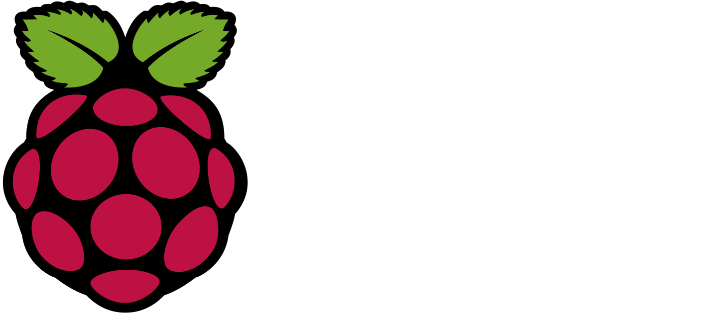

<sub><i style="color: #888888;"><!-- LAST_UPDATED -->Last updated: 18:54 UTC<!-- END_LAST_UPDATED --></i></sub>
<p align="center">
  
</p>

<h1 align="center">Homelab Stack</h1>

<p align="center">
  <strong>Containerized Network & Monitoring Stack on Low-Resource Hardware</strong>
</p>

<p align="center">
  
  
</p>

<p align="center">
  
  
  
  
  
</p>

<p align="center">
  <a href="#overview">Overview</a> •
  <a href="#stack">Stack</a> •
  <a href="#architecture">Architecture</a> •
  <a href="#monitoring">Monitoring</a> •
  <a href="#design-rationale">Design</a> •
  <a href="#threat-model">Security</a>
</p>

---

## Overview

Homelab built on a Raspberry Pi 2B running as an always-on infrastructure node. The Pi handles DNS filtering, overlay networking, containerized services, lightweight NAS storage, and infrastructure monitoring, all without exposing any public ports.

---

## Stack

### Hardware

- Raspberry Pi 2B (1GB RAM, always-on)
- NVMe drive (container volumes and persistent data)

### Networking

- Tailscale (WireGuard-based mesh VPN)
- Subnet router for `192.168.1.0/24`
- Exit node capability for full-tunnel routing

### Containers

- Docker
- Portainer (management UI)

### Monitoring

- Prometheus + Node Exporter → Grafana
- Tracks CPU, memory, disk, network, and load metrics

### Services

- Pi-hole (DNS filtering + query logging)
- [4get](https://git.lolcat.ca/lolcat/4get) (self-hosted search frontend)

### Resilience

- log2ram (reduces SD card writes by buffering logs in RAM)
- Watchdog (automatic reboot on system hang)

### Provisioning

- Ansible (automated setup and deployment)

---

## Incidents & Troubleshooting

| Incident | Root Cause | Doc |
|---|---|---|
| System instability, DNS failures, container hangs | Swap thrashing on SD card under memory pressure | [swap-migration.md](docs/troubleshooting/swap-migration.md) |
| Docker containers unresponsive despite showing as Up | Memory pressure causing inconsistent Docker state | [docker-unresponsive-incident.md](docs/troubleshooting/docker-unresponsive-incident.md) |

---

## Getting Started

### Configuration

Before deploying, edit `group_vars/all.ini` to match your setup:

```ini
user: pi                          # user on the target machine
compose_path: /home/pi            # where docker-compose.yml will be copied to
compose_file: docker-compose.yml
tailscale_authkey: XXXXX          # replace with your Tailscale auth key
```

You can generate a Tailscale auth key at [login.tailscale.com/admin/settings/keys](https://login.tailscale.com/admin/settings/keys).

Also make sure `prometheus.yml` exists at the repo root before deploying, Prometheus expects it on startup.

Volume permissions for Grafana and Prometheus are set automatically by the playbook. No manual `chown` required.

Memory limits are set per container in `docker-compose.yml` and tuned for the Pi 2B (1GB RAM). Adjust `mem_limit` values if running on different hardware.

If you don't want the 4get scraper service, remove it from `docker-compose.yml` before running.

### Automated provisioning (Ansible)

Once configured, provision and deploy everything with a single command:

```bash
ansible-playbook -i inventory.ini playbook.yml
```

The playbook handles everything: installing Docker, Docker Compose, and Tailscale, authenticating the node, enabling Samba, configuring log2ram and the hardware watchdog, and deploying the container stack automatically.

### Manual deployment

If Docker is already set up, bring up the stack directly:

```bash
docker compose up -d
```

Persistent data is stored in named Docker volumes. No manual permission setup required.

---

## Architecture

The Pi serves as subnet router, exit node, DNS server (Pi-hole), Docker host, and monitoring node.

```
                      ┌─────────────────────┐
                      │      Internet       │
                      └──────────┬──────────┘
                                 │
                      ┌──────────▼──────────┐
                      │     Tailscale       │
                      │   (WireGuard VPN)   │
                      └──────────┬──────────┘
                                 │
          ┌──────────────────────▼──────────────────────┐
          │              Raspberry Pi 2B                │
          │                                             │
          │  ┌────────────── Docker ───────────────┐    │
          │  │  Grafana        (dashboards)        │    │
          │  │  Prometheus     (metrics)           │    │
          │  │  Node Exporter  (host metrics)      │    │
          │  │  Portainer      (container mgmt)    │    │
          │  │  4get           (search frontend)   │    │
          │  └─────────────────────────────────────┘    │
          │                                             │
          │  Pi-hole + Unbound  (DNS / ad-blocking)     │
          │  Samba              (NAS)                   │
          │  log2ram            (SD card protection)    │
          │  Watchdog           (auto-reboot on hang)   │
          │                                             │
          │  Storage: SD card (OS) + NVMe (data/swap)   │
          └──────────────────┬──────────────────────────┘
                             │
                    ┌────────▼────────┐
                    │    Home LAN     │
                    │ 192.168.1.0/24  │
                    └─────────────────┘

Clients (via Tailscale mesh):
  - Laptop
  - Phone
  - Restricted network  →  exit node routing
```

All services run as Docker containers. No inbound ports are open. Remote access goes exclusively through Tailscale's encrypted overlay network.

---

## Monitoring

Metrics pipeline: `Node Exporter → Prometheus → Grafana`

Prometheus scrapes host-level metrics from Node Exporter at regular intervals. Grafana provides dashboards for tracking resource usage and identifying bottlenecks on constrained hardware.

---

## Network Behavior

**Normal operation:** Devices connect via Tailscale mesh. Traffic is peer-to-peer where possible. DNS queries go through Pi-hole.

**Restricted networks (e.g. university Wi-Fi):** Exit node is enabled, routing all traffic through the Pi. DNS filtering stays active.

---

## Design Rationale

No port forwarding, no public-facing services. The overlay VPN handles all remote access, which keeps the attack surface minimal. Docker provides service isolation and portability. Portainer handles container lifecycle. Prometheus + Grafana give visibility into system health. log2ram reduces SD card wear, and the hardware watchdog ensures automatic recovery from hangs. Ansible ensures the whole setup is reproducible and version-controlled.

---

## Threat Model

| Threat | Mitigation |
|---|---|
| Automated internet scans | No public inbound ports |
| Open port exposure | Overlay VPN (Tailscale) for all access |
| Unencrypted traffic on public Wi-Fi | Exit node + WireGuard encryption |
| DNS tracking / malicious domains | Pi-hole DNS filtering |
| Container breakout | Docker isolation + limited permissions |

---

## Limitations

- Pi 2B: constrained CPU and 1GB RAM
- USB 2.0 bottleneck for NVMe storage
- Single point of failure (no redundancy)
- Dependent on Tailscale's coordination server
- Not suitable for compute-heavy workloads

---

## TODO

- [x] Container memory limits (`mem_limit` / `--memory`)
- [ ] Syncthing for automated photo backups
- [ ] Reverse proxy for internal service routing (Caddy / Traefik)
- [ ] NAS backup automation
- [ ] Expand homelab with an additional node (offload heavy services)
- [x] Infrastructure as Code (Ansible / Docker Compose versioning)
