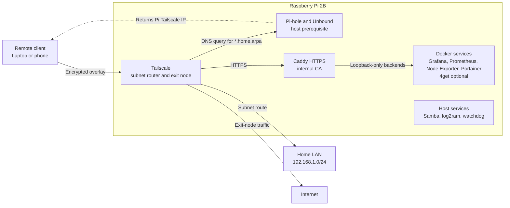

<p align="center">
  
</p>

<h1 align="center">Homelab Stack</h1>

<p align="center">
  <strong>Containerized Network & Monitoring Stack on Low-Resource Hardware</strong>
</p>

<p align="center">
  
  
  
</p>

<p align="center">
  
  
  
  
  
</p>

<p align="center">
  <a href="#overview">Overview</a> •
  <a href="#stack">Stack</a> •
  <a href="#architecture">Architecture</a> •
  <a href="#monitoring">Monitoring</a> •
  <a href="#design-rationale">Design</a> •
  <a href="#threat-model">Security</a>
</p>

---

## Overview

Homelab built on a Raspberry Pi 2B running as an always-on infrastructure node. The Pi handles DNS filtering, overlay networking, containerized services, lightweight NAS storage, and infrastructure monitoring, all without exposing any public ports.

---

## Stack

### Hardware

- Raspberry Pi 2B (1GB RAM, always-on)
- NVMe drive (container volumes and persistent data)

### Networking

- Tailscale (WireGuard-based mesh VPN)
- Subnet router for `192.168.1.0/24`
- Exit node capability for full-tunnel routing
- Split DNS routing for internal services

### Private HTTPS access

Internal services are exposed through a Caddy reverse proxy using private HTTPS.

DNS resolution is handled by Pi-hole with the `home.arpa` namespace:

- `grafana.home.arpa`
- `4get.home.arpa`
- `portainer.home.arpa`
- `prometheus.home.arpa`

Pi-hole resolves service names to the Raspberry Pi Tailscale address, and Caddy routes HTTPS requests to the correct local Docker service.

Caddy uses an internal CA for TLS certificates trusted by local clients.

---

### Internal DNS

Services use the reserved `home.arpa` namespace.

Pi-hole and Unbound are host-level prerequisites in the current repository; the
Ansible playbook does not install or configure them yet.

DNS lookup:

`Client → Tailscale DNS → Pi-hole → Raspberry Pi Tailscale IP`

Examples:

- <https://grafana.home.arpa>
- <https://4get.home.arpa>
- <https://portainer.home.arpa>
- <https://prometheus.home.arpa>
- <https://node-exporter.home.arpa>
- <https://pihole.home.arpa>

### Containers

- Docker
- Portainer (management UI)

### Monitoring components

- Prometheus + Node Exporter → Grafana
- Tracks CPU, memory, disk, network, and load metrics

### Services

- Pi-hole (DNS filtering + query logging)
- [4get](https://git.lolcat.ca/lolcat/4get) (self-hosted search frontend)

### Resilience

- log2ram (optional; reduces SD card writes by buffering logs in RAM)
- Watchdog (automatic reboot on system hang)

### Provisioning

- Ansible (automated setup and deployment)

---

## Incidents & Troubleshooting

| Incident | Root Cause | Doc |
|---|---|---|
| System instability, DNS failures, container hangs | Swap thrashing on SD card under memory pressure | [swap-migration.md](docs/troubleshooting/swap-migration.md) |
| Docker containers unresponsive despite showing as Up | Memory pressure causing inconsistent Docker state | [docker-unresponsive-incident.md](docs/troubleshooting/docker-unresponsive-incident.md) |

---

## Getting Started

### Configuration

Before deploying, create your local Ansible config from the example:

```bash
cp group_vars/all.yml.example group_vars/all.yml
```

Then edit `group_vars/all.yml` to match your setup:

```yaml
user: pi
compose_path: /home/pi/homelab-stack
compose_file: docker-compose.yml

docker_data_root: /mnt/nvme/docker
service_bind_address: 127.0.0.1
enable_log2ram: false

tailscale_authkey: XXXXX
tailscale_hostname: homelab-pi
tailscale_advertise_routes: 192.168.1.0/24
tailscale_advertise_exit_node: true
```

You can generate a Tailscale auth key at [login.tailscale.com/admin/settings/keys](https://login.tailscale.com/admin/settings/keys).
The auth key can also be supplied with the `TAILSCALE_AUTHKEY` environment variable for the first provisioning run.

By default, the playbook binds Docker-published backend ports to `127.0.0.1` and
binds Caddy's HTTPS listener to the node's Tailscale IPv4 address. This prevents
clients from bypassing Caddy while keeping service access inside the tailnet.

log2ram is disabled by default because it is not supplied by every Raspberry Pi
OS package source. To enable it, first configure a trusted repository that
provides the `log2ram` package, then set `enable_log2ram: true`. The playbook does
not add a Debian repository to Raspberry Pi OS.

Prometheus config and alert rules live in `prometheus/` and are copied by the playbook.

Container data is stored under `docker_data_root`, so Caddy, Grafana, Prometheus,
and Portainer state can live on NVMe instead of the SD card. Volume permissions
are set automatically by the playbook. No manual `chown` is required.

Memory limits are set per container in `docker-compose.yml` and tuned for the Pi 2B (1GB RAM). Adjust `mem_limit` values if running on different hardware.

External images are pinned to explicit ARMv7-compatible releases to keep
deployments reproducible. The stack currently uses Caddy `2.11.4`, Prometheus
`3.5.5` LTS, Node Exporter `1.12.1`, Grafana `13.2.1-slim`, and Portainer
`2.39.7-linux-arm-alpine`. Review and test version updates deliberately rather
than tracking mutable `latest` tags.

Healthchecks are configured for Caddy, Prometheus, Node Exporter, Grafana, and
Portainer. Check their status after deployment with:

```bash
docker compose ps
```

The 4get scraper service is behind the optional Compose profile. To include it, run Compose with `--profile optional`.

### Automated provisioning (Ansible)

Once configured, provision and deploy everything with a single command:

```bash
ansible-playbook -i inventory.ini playbook.yml
```

The playbook handles installing Docker, Docker Compose, Tailscale, and Samba; authenticating the node; enabling IPv4 forwarding; advertising the subnet route and exit node; configuring the hardware watchdog; optionally enabling log2ram when requested; copying Prometheus configuration; and deploying the container stack automatically.

After the first Tailscale run, approve the advertised subnet route and exit node in the Tailscale admin console if required by your tailnet policy.

### Manual deployment

If Docker is already set up, bring up the stack directly:

```bash
cp .env.example .env
$EDITOR .env
docker compose up -d
```

For manual deployment, keep `SERVICE_BIND_ADDRESS=127.0.0.1` and set
`TAILSCALE_IP` in `.env` to the output of `tailscale ip -4`. Persistent data is
stored under `DOCKER_DATA_ROOT` from `.env`.

### Trust the private CA

Caddy issues certificates from its private internal CA. After the first start,
copy the generated root certificate out of the container:

```bash
docker compose cp caddy:/data/caddy/pki/authorities/local/root.crt ./caddy-root.crt
```

Import that certificate into the operating system or browser trust store, then
verify the connection:

```bash
curl --cacert ./caddy-root.crt https://grafana.home.arpa
```

---

## Architecture

The Pi serves as subnet router, exit node, DNS server (Pi-hole), reverse proxy (Caddy), Docker host, and monitoring node.


```mermaid
flowchart LR
    Client[Remote client<br/>Laptop or phone]

    subgraph Pi[Raspberry Pi 2B]
        TS[Tailscale<br/>subnet router and exit node]
        DNS[Pi-hole and Unbound<br/>host prerequisite]
        Caddy[Caddy HTTPS<br/>internal CA]
        Apps[Docker services<br/>Grafana, Prometheus, Node Exporter, Portainer<br/>4get optional]
        Host[Host services<br/>Samba, log2ram, watchdog]
    end
    LAN[Home LAN<br/>192.168.1.0/24]
    Internet[Internet]

    Client -->|Encrypted overlay| TS
    TS -->|DNS query for *.home.arpa| DNS
    DNS -.->|Returns Pi Tailscale IP| Client
    TS -->|HTTPS| Caddy
    Caddy -->|Loopback-only backends| Apps
    TS -->|Subnet route| LAN
    TS -->|Exit-node traffic| Internet
```

### Traffic flow

```text
DNS lookup:    Client → Tailscale DNS → Pi-hole → Raspberry Pi Tailscale IP
HTTPS request: Client → Tailscale overlay → Caddy → Docker service
```

Application and monitoring services run in Docker. Tailscale, Samba, the
hardware watchdog, optional log2ram, and the current Pi-hole/Unbound setup run on the host.
No router port forwarding is required; remote HTTPS access is bound to the
Tailscale interface.

---

## Monitoring

Metrics pipeline: `Node Exporter → Prometheus → Grafana`

Prometheus scrapes host-level metrics from Node Exporter at regular intervals. Grafana provides dashboards for tracking resource usage and identifying bottlenecks on constrained hardware.

Basic Prometheus alert rules are included for unreachable Node Exporter, high memory usage, swap usage, low disk space, and sustained load.

The GitHub Actions badge update workflow runs through the private homelab network using Tailscale, internal DNS resolution, and Caddy HTTPS validation.

See [`GitHub Actions Metrics Pipeline`](.github/docs/github-actions-pipeline.md) for the complete architecture and security model.

---

## Network Behavior

**Normal operation:** Devices connect via Tailscale mesh. Traffic is peer-to-peer where possible. DNS queries go through Pi-hole.

**Restricted networks (e.g. university Wi-Fi):** Exit node is enabled, routing all traffic through the Pi. DNS filtering stays active.

No router port forwarding is required or expected. Remote access is handled
through Tailscale, Caddy listens on the Tailscale address, and container backend
ports are bound to loopback by default when deployed with Ansible.

---

## Design Rationale

No port forwarding and no public-facing services. The overlay VPN handles remote
access, Caddy is the only HTTPS entry point, and application backends remain on
loopback. Docker provides service isolation and portability, while Portainer is
treated as a privileged administration component because it can access the
Docker socket. Prometheus + Grafana provide system visibility, optional log2ram
can reduce SD card wear, and the hardware watchdog provides automatic recovery from hangs.
Ansible keeps the setup reproducible and version-controlled.

---

## Threat Model

| Threat | Mitigation |
|---|---|
| Automated internet scans | No public inbound ports |
| Open port exposure | Overlay VPN (Tailscale) for all access |
| Unencrypted traffic on public Wi-Fi | Exit node + WireGuard encryption |
| DNS tracking / malicious domains | Pi-hole DNS filtering |
| Container breakout / Docker socket abuse | Loopback-only backends, tailnet-restricted management access, and explicit treatment of Portainer as a privileged component |
| Management plane exposure | Bind Caddy to the Tailscale IP and keep backend services on loopback |

---

## Limitations

- Pi 2B: constrained CPU and 1GB RAM
- USB 2.0 bottleneck for NVMe storage
- Single point of failure (no redundancy)
- Dependent on Tailscale's coordination server
- Not suitable for compute-heavy workloads
- Portainer requires Docker socket access, which should be treated as highly privileged
- Pi-hole and Unbound are documented host prerequisites but are not yet provisioned by Ansible
- The local `fourget-armhf` image must be built separately before enabling the optional profile

---

## TODO

- [x] Container memory limits (`mem_limit` / `--memory`)
- [x] NVMe-backed container data paths
- [x] Prometheus alert rules
- [x] Tailscale subnet route / exit node provisioning
- [ ] Syncthing for automated photo backups
- [x] Private HTTPS reverse proxy with Caddy
- [x] Internal DNS with Pi-hole + home.arpa
- [ ] NAS backup automation
- [ ] Expand homelab with an additional node (offload heavy services)
- [x] Infrastructure as Code (Ansible / Docker Compose versioning)
